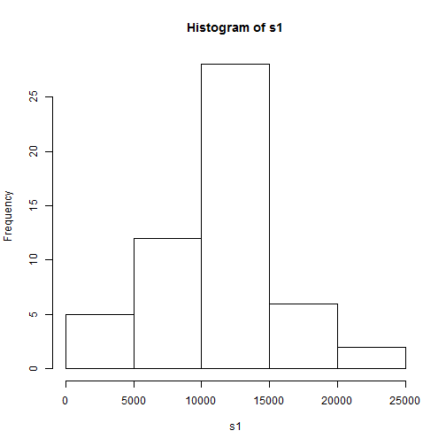
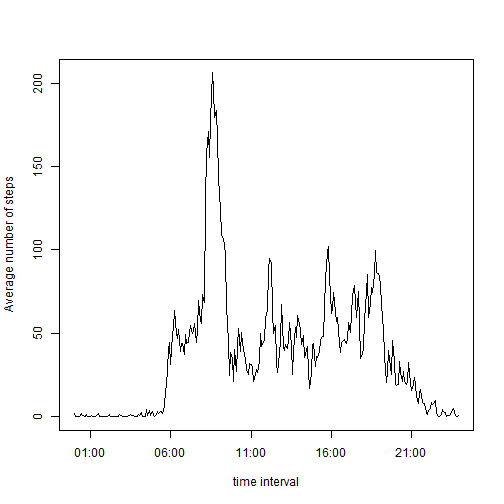
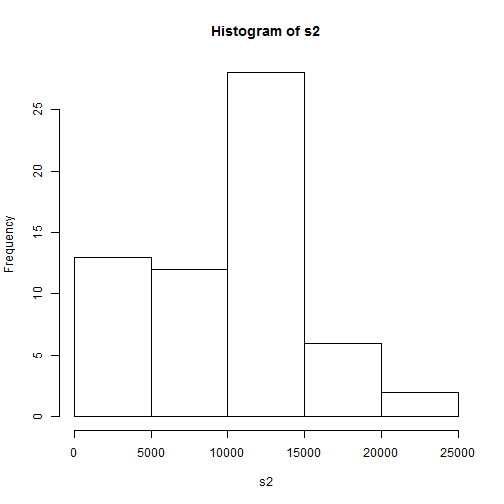
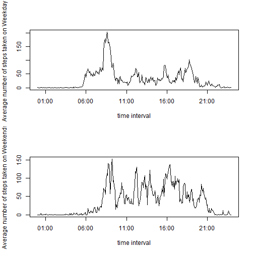

This is the submission for Peer Assessment #1 for Reproducible Research. Set the working directory and load the raw data from the activity band into a dataframe rawdata


```r
setwd("~/DataScience/Rwork/ReproducibleResearch")

rawdata<-read.csv("activity.csv")
```

Copy rawdata into data1, and then create a vector that sums the steps for each day.

```r
data1<-rawdata
s1<-tapply(data1$steps,data1$date,FUN=sum)
```

Make a histogram of the total number of steps taken each day

```r
hist(s1)
```

 


Calculate the mean and median of the number of steps taken per day

```r
print("This is the mean value")
```

```
## [1] "This is the mean value"
```

```r
print(mean(s1, na.rm=TRUE))
```

```
## [1] 10766.19
```

```r
print("This is the median value")
```

```
## [1] "This is the median value"
```

```r
print(median(s1, na.rm=TRUE))
```

```
## [1] 10765
```

Now we will convert the date and interval into a POSIX time.  First, the interval must be 
padded with leading zeros to make a 4 character string. Also, add a column to the frame that holds the interval as a factor


```r
data1$intervalpadded<-sprintf("%04d", as.numeric(data1$interval))

data1$times<-as.POSIXct(paste(as.character(data1$date),as.character(data1$intervalpadded)), format = "%Y-%m-%d %H%M")
data1$intervalfactor<-as.factor(data1$intervalpadded)

intervalaverage<-tapply(data1$steps,data1$intervalfactor,FUN=mean, na.rm=TRUE)
intervalaverage<-data.frame(intervalaverage)
intervalaverage$times<-as.POSIXct(dimnames(intervalaverage)[[1]],format = "%H%M")
```
Plot the time series of the average number of steps taken over all days for each time interval


```r
plot(intervalaverage[,2],intervalaverage[,1], type="l", xlab="time interval", ylab="Average number of steps")
```

 


```r
n1<-which.max(intervalaverage[,1])

print("Time interval of max value")
```

```
## [1] "Time interval of max value"
```

```r
print(names(intervalaverage[n1,1]))
```

```
## [1] "0835"
```

```r
print("max value at this interval")
```

```
## [1] "max value at this interval"
```

```r
print(intervalaverage[n1,1][[1]])
```

```
## [1] 206.1698
```


Now the goal is to replace the NA values in the steps column with the mean for that day.


```r
dailyaverage<-tapply(data1$steps,data1$date,FUN=mean, na.rm=TRUE)
dailyaverage[is.nan(dailyaverage)] <- 0
dailyaveragedf <- data.frame(date=names(dailyaverage),mean=dailyaverage)

data2<-merge(dailyaveragedf,data1,by = 'date')
```

Replace the NA values with the mean for that day


```r
data2$imputedsteps<-data2$steps
NAsteps<-is.na(data2$steps)
data2$imputedsteps[NAsteps]<-data2$mean[NAsteps]
```

Create a histogram of the total number of steps taken each day with the imputed values


```r
s2<-tapply(data2$imputedsteps,data1$date,FUN=sum)
hist(s2)
```

 

Calculate the mean and median of the number of steps taken per day


```r
print("This is the mean value")
```

```
## [1] "This is the mean value"
```

```r
print(mean(s2, na.rm=TRUE))
```

```
## [1] 9354.23
```

```r
print("This is the median value")
```

```
## [1] "This is the median value"
```

```r
print(median(s2, na.rm=TRUE))
```

```
## [1] 10395
```

Both the mean and median are lower than before because of the added imputed values.

Now we will add a factor with two levels: weekday and weekend for each date


```r
data2$days<-weekdays(data2$times)
data2$daytype <- factor(data2$days, levels=c("Monday","Tuesday","Wednesday","Thursday","Friday","Saturday","Sunday"), labels=c("weekday","weekday","weekday","weekday","weekday","weekend", "weekend"))
```

```
## Warning in `levels<-`(`*tmp*`, value = if (nl == nL) as.character(labels)
## else paste0(labels, : duplicated levels in factors are deprecated
```

Now split up into two data frames, one for weekdays and the other for weekend days


```r
data2weekdays <- data2[data2$daytype == "weekday", ]
data2weekend <- data2[data2$daytype == "weekend", ]

intervalaverageweekday<-tapply(data2weekdays$imputedsteps,data2weekdays$intervalfactor,FUN=mean, na.rm=TRUE)
intervalaverageweekday<-data.frame(intervalaverageweekday)
intervalaverageweekday$times<-as.POSIXct(dimnames(intervalaverageweekday)[[1]],format = "%H%M")

intervalaverageweekend<-tapply(data2weekend$imputedsteps,data2weekend$intervalfactor,FUN=mean, na.rm=TRUE)
intervalaverageweekend<-data.frame(intervalaverageweekend)
intervalaverageweekend$times<-as.POSIXct(dimnames(intervalaverageweekend)[[1]],format = "%H%M")
```

Create a panel plot containing the time series plots of the average number of steps taken averaged over each type of day.

```r
par(mfcol=c(2,1))


plot(intervalaverageweekday[,2],intervalaverageweekday[,1], type="l", xlab="time interval", ylab="Average number of steps taken on Weekdays")
plot(intervalaverageweekend[,2],intervalaverageweekend[,1], type="l", xlab="time interval", ylab="Average number of steps taken on Weekends")
```

 

